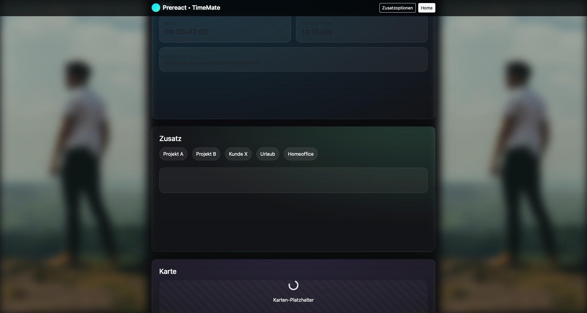
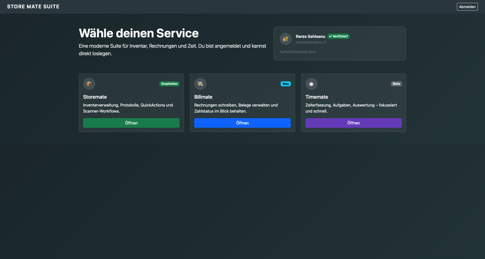
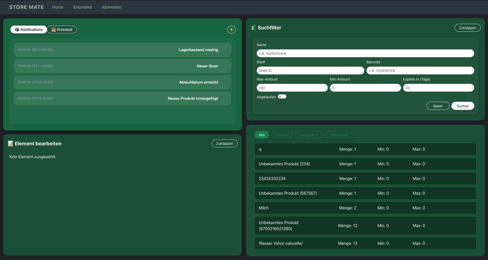

# Prereact — Medical Practice Management System

## English

**Prereact** is a modular **practice management system** for medical professionals.  
It provides complete solutions for **inventory tracking**, **billing**, **appointment scheduling**, and **administration** — all within one secure, containerized platform.

### Overview

Each module (inventory, scheduling, billing, authentication, admin) is **fully dockerized** and includes its own **frontend**, **backend**, and **database**.  
All components are deployed behind an **NGINX reverse proxy** with **automated SSL certification** for secure HTTPS connections.

### Architecture

- **Frontend:** React, Bootstrap, Tailwind CSS, Vite, Node.js  
- **Backend:** FastAPI (Python)  
- **Databases:** PostgreSQL and MongoDB  
- **Proxy:** NGINX reverse proxy + Certbot for automatic SSL renewal  
- **Authentication:** Centralized token-based system with user roles  
- **Deployment:** Modular Docker / Docker Compose setup  

### Features

- **Inventory System** — tracks medical supplies and stock flow  
- **Billing System** — manages invoices and payments  
- **Appointment Scheduling** — patient and staff scheduling tools  
- **Admin Panel** — centralized control for users and system configuration  
- **Authentication Service** — unified login and role management  
- Automated SSL setup and renewal  
- Isolated frontend, backend, and database per service  

### Visual Overview

| Component | Screenshot |
|------------|-------------|
| **Main Page** |  |
| **Appointment Scheduler (TimeMate)** |  |
| **Login System** |  |
| **Admin Panel** |  |
| **Inventory System (StoreMate)** |  |

---

## Deutsch

**Prereact** ist ein modulares **Praxisverwaltungssystem** für Ärztinnen und Ärzte.  
Es vereint **Inventur**, **Abrechnung**, **Terminvergabe** und **Verwaltung** in einer sicheren, containerisierten Umgebung.

### Übersicht

Jeder Dienst (Inventur, Terminplanung, Abrechnung, Authentifizierung, Administration) ist **vollständig dockerisiert** und besitzt ein eigenes **Frontend**, **Backend** und eine **Datenbank**.  
Ein **NGINX-Reverse-Proxy** mit **automatischer SSL-Zertifizierung** sorgt für verschlüsselte Verbindungen über HTTPS.

### Architektur

- **Frontend:** React, Bootstrap, Tailwind CSS, Vite, Node.js  
- **Backend:** FastAPI (Python)  
- **Datenbanken:** PostgreSQL und MongoDB  
- **Proxy:** NGINX (Reverse Proxy + Certbot-basierte SSL-Automatisierung)  
- **Authentifizierung:** Zentrales Token-System mit Rollenverwaltung  
- **Deployment:** Modularer Aufbau mit Docker / Docker Compose  

### Funktionen

- **Inventursystem (StoreMate)** — Verwaltung medizinischer Bestände  
- **Abrechnungssystem** — Erstellung und Verwaltung von Rechnungen  
- **Terminplanung (TimeMate)** — Buchung und Verwaltung von Terminen  
- **Administrationspanel** — Benutzer- und Systemverwaltung  
- **Login- und Authentifizierungsdienst** — Einheitlicher Zugang zu allen Modulen  
- Automatische SSL-Einrichtung und Zertifikatserneuerung  
- Getrennte Frontend-, Backend- und Datenbankschichten für jeden Service  

### Visuelle Darstellung

| Komponente | Screenshot |
|-------------|-------------|
| **Hauptseite** |  |
| **Terminplanung (TimeMate)** |  |
| **Login-System** |  |
| **Administrationspanel** |  |
| **Inventursystem (StoreMate)** |  |
